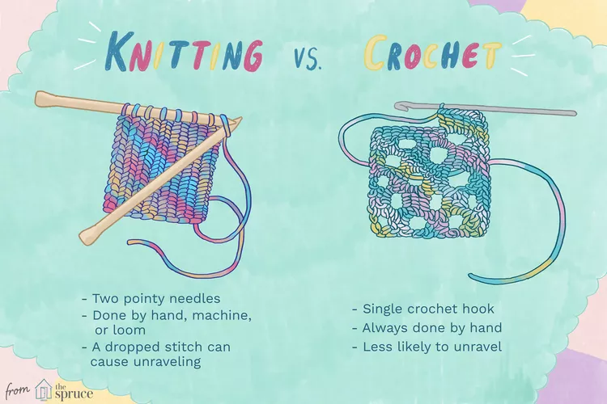

# Intro
Amongst many handcrafting hobbies, there is crocheting. Crocheting involves weaving a yarn stitch by stitch to create a piece of fabric. The craft is commonly confused with knitting, although the techniques are vastly different.

https://www.thesprucecrafts.com/differences-between-knitting-and-crochet-4077447

Crocheting makes it easy to create 3-dimensional shapes, and the pieces are generally sturdier than knitted ones, making the technique well suited for things that should keep their shape such as decorations or toys.

> crochet as a tool to visualize hyperbolic geometry
> https://www.cabinetmagazine.org/issues/16/wertheim_henderson_taimina.php

This project puts it's focus on using crocheting to create 3-dimentional, stuffed shapes, an art called [amigurumi](https://en.wikipedia.org/wiki/Amigurumi).

The person crocheting, works by following a *pattern* that describes the sequence of stitches necessary to achieve a certain shape. Designing such a pattern is trivial for axially symmetrical shapes, but otherwise requires much trial and error.

>dino's body+tail is an example of non-symmetrical shape\
>ai generated, but proves the point\
>sites providing patterns use ai images to lure artists by using more attractive shapes, that they don't have patterns for \
>
> https://theamigurumi.com/wp-content/uploads/2024/01/Crochet-Dinosaur-Trex-Amigurumi.jpg
>

There are currently no tools that could help with designing such shapes. The closest thing is [Crochet Lathe](https://avtanski.net/projects/crochet/lathe/), however the tool is still limited by requiring axial symmetry.

The goal of this project is to create a tool, that would let an artist visualize the plushie that their pattern produces before commiting hours into actually crocheting it.

# Domain specific terminology
> This is not a crochet guide. The terms presented have a broader meaning in the crocheting community, and the processes are more nuanced. This section aims to give just enough information to understand the algorithms described in further sections.
> working starts from a circle\
> worked in rounds\
> define basic stitches (sc, inc, dec)\
> sharper corner are made with back loop only, front loop only (BLO, FLO)\
> explain fasten off (FO)\
> hook can be reinserted into a plushie (grzib is a good example)\
> branches are created with chains and gotos\
> sewing multiple parts together (not in scope)

# Theory
## Pattern as a formal language
> (paywall) Parsing Semi-structured Languages: A Crochet Pattern to Diagram Translation, https://www.springerprofessional.de/en/parsing-semi-structured-languages-a-crochet-pattern-to-diagram-t/25864374

In order to process a crochet pattern, we need to express it using a formal language. Patterns shared in the community have equivalent overall structure, but do not follow a strict grammar.
> list examples of differences?
> https://whimsicalyarncreations.com/axolotl-free-pattern/
> https://yarnsociety.com/patterns/celia-the-crab/
> https://www.themaryjay.com/free-patterns/crochet-turtle-pattern

This project shall define a domain specific language, *amigurumi crochet language (ACL)*, that should be easily understood by creators that can read a pattern found online. The language shall have a formal, context-free [grammar](..\src\flow\pest_parser\pat.pest), so a parser for it can be implemented.

> provide a few examples

## Simulation

# Implementation
## Backend
### Pest-parser
> ACL -> list of stitches
### Hook
> list of stitches -> non-spatial graph of connected stitches
### Simulation
> graph -> spatial graph of stitches
### Stuffing
> relaxing the graph

## Frontend
> websockets, threejs, dat.gui
> simulation controls

# Results

# Goal summary