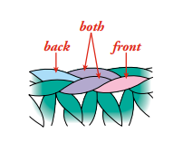

# Crocheting

This section aims to give just enough information about crocheting to understand the algorithms described in further sections. A curious reader can find more details in dedicated guides [[3]][[9]].

Amigurumi patterns are structured around *rounds* as they enable the craftsperson to easily keep track of their progress. The first round is created by performing a magic ring [[9]][[10]] (abbreviated as MR). MR creates a circle of several stitches that serve as the foundation for the piece. As part of any subsequent stitch, the yarn is pulled through a stitch from the previous round. A stitch from the previous round is called an anchor in this paper. Once a stitch is created on an anchor, that anchor is used up and the next new stitch must be attached to the next anchor. Once all anchors (stitches from the previous round) are used up, a new round starts. Note that rounds have precise start and end points.

The most basic stitch in amigurumi is a Single Crochet (sc) ([[3]] page 7, [[11]]). Single Crochet consumes a single anchor, and produces one as well. A full round of just Single Crochets has a perimeter of exactly the same length as the previous round, and creating multiple such rounds would result in a cylinder.

The next stitch, Increase (inc) ([[3]] page 12, [[11]]) is very similar as it is essentialy two Single Crochets using the same anchor. Inc consumes a single anchor, but produces two for the next round to use. Using increases makes the surface curve outwards. Doing multiple rounds of increases results in a representation of a hyperbolic plane [[7]].

In some way, the opposite of Increase is the Decrease stitch (dec) ([[3]] page 12). Decrease uses two anchors, but produces just one for the next round. Using decreases makes the surface curve inwards. Doing multiple rounds of decreases eventually closes up the shape.

When the creation ready to be closed up, a Fasten Off (FO) ([[4]]) is performed, so that it is closed tightly and no stuffing can escape.

Each individual stitch consists of two loops, back and front one as seen on figure X. Stitches are typically anchored to both of these loops in the previous round

[[3]] page 12

>> working starts from a circle (MR/Ch)\
>> worked in rounds\
>> define basic stitches (sc, inc, dec)\
> sharper corner are made with back loop only, front loop only (BLO, FLO)\
>> explain fasten off (FO)\
> hook can be reinserted into a plushie (grzib is a good example)\
> branches are created with chains and gotos\

[3]: https://www.montana.edu/extension/blaine/4-h/4h_documents/CrochetMadeEasy.pdf
[4]: https://crochettoplay.com/how-to-fasten-off-in-amigurumi/
[7]: https://mathvis.academic.wlu.edu/2016/06/15/crocheted-hyperbolic-planes/
[9]: https://www.tinycurl.co/how-to-amigurumi-crochet/#stitches
[10]: https://www.youtube.com/watch?v=P2b0j2xBd6I
[11]: https://www.youtube.com/watch?v=GyjDd5tAhdU