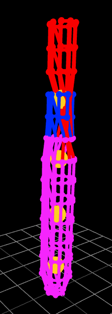
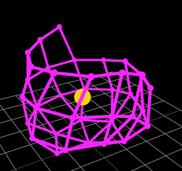
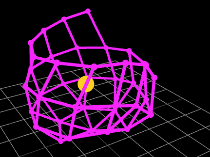
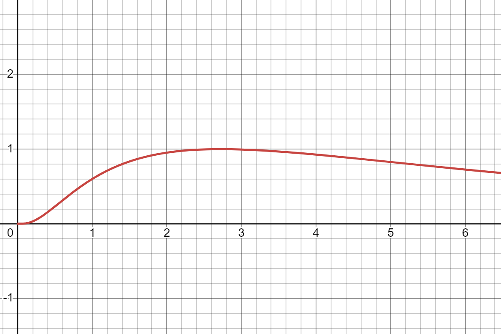

## Simulation overview
Two kinds of forces need to act on a Plushie. First one, *link force*, shall try to keep connected stitches at a specific distance from one another. Second one, *stuffing force*, shall simulate the effect of stuffing inside the piece on the fabric. The first force is trivial, but for the second one, we need to get a notion on where is the inside of the Plushie.

Two approaches are explored for *stuffing force*, that we call *centroid stuffing* and *skeleton stuffing*.

## Initial node positions
Before forces can be applied to the graph, it's nodes have to be assigned some initial positions, that is $N: I \rightarrow \R^3$.

Crocheteer implements two position initializers that the user can select using ACL's parameter `initializer`.

### Cylinder initializer
The default initializer in Crocheteer is cylinder initializer. It can also be explicitly selected selected by using:
```
@initializer = cylinder
```

In this method, each round (as per `round_spans` from section 4) is arranged in a ring laying parallel to the horizontal plane, and every round is placed higher along the vertical axis. The resulting shape is a generalized cylinder [[2]] [6] as shown in figure X. Centroids (see section 5.X) are initialized along the vertical axis in regular intervals. This method guarantees centroids at least start on the inside of the Plushie.


Y shape as per pattern X, initialized with the cylinder method.

### One by one initializer
One by one is an alternative initializer selected by:
```
@initializer = obo
```
In this method, the simulation starts with a single point at the origin, and new nodes are added as the simulation runs.

A new node is added once the cumulative forces on the previous node get under a certain threshold (0.03 in Crocheteer), or if a node has not been created in 100 steps.

Position for the new node is calculated as in algorithm X, based on the average position of nodes it is connected to. Experiments show that adding a constant vector pointing up makes the node reach it's desired position quicker. The first 2 nodes are treated as edge cases and their positions are set in a way that promotes building the Plushie in a clockwise manner.

```
fn new_node_position(&self, based_on: &Vec<usize>) -> Point {
        let dsd = self.params.desired_stitch_distance;

        if based_on.len() == 0 {
            panic!("Node should be attached to something");
        } else if self.nodes.points.len() == 1 {
            Point::from(self.nodes.points[0] + V::new(dsd, dsd * 0.1, 0.0))
        } else if self.nodes.points.len() == 2 {
            Point::from(self.nodes.points[0] + V::new(0.0, dsd * 0.2, dsd))
        } else if based_on.len() == 1 {
            let base = self.nodes.points[based_on[0]];
            let coords = base.coords + V::new(0.0, dsd, 0.0);
            Point::from(coords)
        } else {
            let mut avg = V::zeros();
            for base in based_on {
                let point = self.nodes.points[*base];
                avg += point.coords;
            }
            avg /= based_on.len() as f32;
            avg += V::new(0.0, dsd, 0.0);
            Point::from(avg)
        }
    }
```
<!-- TODO pseudocode -->




Plushie being built with one by one initializer.
<!-- TODO combine into one figure -->

In this approach, centroids (section 5.X) must be introduced gradually. By default, a new centroid is added once 60 nodes are created. That number is configurable through the GUI (section 6).

## Link force
Link force acts between each two nodes connected as per $E$ along a vector from one to another. Nodes far away from each other will be pulled together, while those clumped together will be pushed away. This force is inspired by one of the approaches used for force-directed graph drawing [8]. Magnitude of link force between nodes $i,j \in I$ is defined as $F_\text{link}$. $d$ is *desired stitch distance*, that it a distance at which nodes will not affect each other. $d$ is set to 1.0 by default in Crocheteer. Figure X shows a plot of $F_\text{link}$.

$$
F_\text{link}(i, j) = \frac{\left(\|N_iN_j\|-d\right)^{3}}{\left(\frac{\|N_iN_j\|}{2}+d\right)^{3}}
$$


Link force magnitue (Y axis) in relation to distance between nodes (X axis) for $d = 1$. Positive value means attraction, negative means repulsion.
<!-- TODO link a desmos page (url changes after each save) -->

Notice that $F_\text{link}(i, j)$ needs to be evaluated only once for each pair of nodes, as the nodes receive the same force magnitude but in opposite directions. The typical node will have 4 connected nodes, with few exceptions for nodes related to `dec` stitches, single loop rounds and `anchor` instructions. Time complexity for calculating link force in the whole Plushie is therefore $O(N)$.

Note that nodes that are not connected do not affect each other at all, so shapes that fold on themselves (e.g. crocheted hyperbolic planes[[7]]) will not be simulated accurately as the fabric clips through itself.

## Centroid stuffing
Centroid stuffing aims to apply a force from inside a Plushie without applying any relatively computation-heavy skeletonization algorithms. The drive for quick computation comes from the ambition to eventually integrate Crocheteer's simulation in a cost/fitness function for a machine learning model that would generate a pattern based on a given 3D model.

Centroids are visible on images in this paper as the orange points inside. Every iteration, each centroid pushes away all nodes of the Plushie with force proportional to square of their distance. A mapping is also created, from each node to it's closest centroid (function `push_and_map`). Then, centroids are repositioned based on the points assigned to them and using a custom weight function (function `recalculate_centroids`). Pushing and mapping is done simultanously in $O(cN)$ time, where $c$ stands for centroid amount. Repositioning of centroids is done in $O(N)$ time.

<!-- FIXME C as centroids clashes with C as colors -->
$$
N: \text{nodes}
\\
C: \{ \R^3 \}
\\
f: \text{force multiplier}
\\
D: N \rightarrow \R^3
\\
M: C \rightarrow \{N\}
$$

Magnitude of the force pushing a node from a centroid is expressed as $F_\text{centroid}(n, c) = \min(\frac{1}{\|nc\|^2}, 1000)$. Min function is used to prevent returning an arbitrarily large value (or even a NaN) that would break the simulation in case the node and centroid would appear very close to each other.

```
fn push_away(point: &Point, repelant: &Point) -> V {
    let diff = point - repelant;
    if diff.magnitude() != 0.0 {
        let res = diff.normalize() * F_centroid(point, repelant);
        res
    } else {
        V::zeros()
    }
}

function push_and_map(N, C, f, D)
    for n in N do
        closest_centroid <- argmin(c in C, ||c n||)
        M_{closest_centroid}.append(n)

        for c in C do
            D_n += push(n, c) * f
        end for
    end for

    return M
end function
```

New positions of each centroid is based on the nodes assigned to it as per $M$ returned from `push_and_map`. Crucially, the new position is a **weighted** average with weight function $w(x)$, where $x$ is the distance between the node and the centroid. It is the contract that initializer (section 5.X) puts centroids **inside** the Plushie before the first iteration. The shape of $w$ has to then ensure that the centroids will not move into walls and pass through to the other side. This is done by putting less weight on nodes that are close to a centroid. There is a certain range (controlled by parameters $b$ and $c$) where nodes get assigned a heavy weight, and for far away nodes, the weight diminishes again. Note that with an appropriate centroid amount, distant nodes will get assigned to other centroids, and thus not affect this calculation.

Ideal values of $b$ and $c$ depend on the volume of a Plushie and curvature of it's surfaces (large flat surfaces require larger values). Crocheteer uses values $b = 1$ and $c = 1.4$, that work well for Plushies where round count is under 30 stitches. Figure X shows the plot of $w(x)$ with those parameters.

$$
w(x) = e^{\frac{-\left(\ln\left(x\right)-b\right)^{2}}{c^{2}}}
$$



It is worth noting that for Plushies that fold onto themselves (have heavily concave regions) centroids can still escape from the inside and sabotage the simulation.

## Skeleton stuffing
[[2]]
<!-- TODO detail amount depending on how many pages I need -->

[2]: https://arxiv.org/pdf/1912.11932

[6]: I. Binford, “Visual perception by computer,” in IEEE Conference of
Systems and Control, 1971.
[7]: https://mathvis.academic.wlu.edu/2016/06/15/crocheted-hyperbolic-planes/
[8]: https://en.wikipedia.org/wiki/Force-directed_graph_drawing